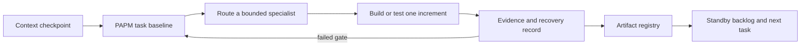

# Master Chief Army — Skills and Training Plan

Version 1.0 · 2026-09-13 · PAPM + Training Officer baseline · Status: proposed

## Mission and decision authority

Train and improve the Master Chief specialist roster so it produces small, verifiable, local-first product increments for Master Chief Hologram. The objective is reliable evidence and operator recovery, not a larger catalog of loosely related agents. PAPM owns this baseline, Training Officer owns the learning design and runbooks, Master Chief reconciles routed work, and the owner accepts releases and supplies any external credentials or signing identity.

This plan proposes skills and skill changes only. It does not install a skill, alter a global skill, provision Apache Spark, change credentials, publish artifacts, or claim a live-device test was run.

## Context checkpoint and evidence

| Item | Current evidence | Training implication |
|---|---|---|
| Voice capture | The app has browser recording, transcript insertion, whisper.cpp readiness checks, and a deterministic fixture; no physical microphone acceptance matrix is recorded. | Train a repeatable device-matrix procedure that separates fixture evidence from real audio evidence. |
| Release | Packaging and package inspection exist, but the local package is ad-hoc signed and no Developer ID identity is evidenced. | Train provenance, rollback, clean-device, and sign/notarize decision handling. |
| Local AI | Ollama and a small local model have been demonstrated; provider, retrieval, and tool boundaries are established. | Train local-first routing, offline validation, prompt contracts, and retrieval evaluation before cloud escalation. |
| Secure operations | Credentials are redacted/stored locally; tools require approval and are restricted to a fixed adapter catalog. | Train consent, secret-free evidence, scope review, and denial-path testing. |
| Visual quality | Asset and visual-regression checks exist; character/icon consistency and accessibility remain ongoing design work. | Train visual acceptance, motion/accessibility review, and asset provenance handoff. |
| Continuity | Durable plans/status exist, but broad upgrades were previously executed in serial increments with changing context. | Train compact checkpoints, task contracts, repository artifact links, and explicit completion evidence. |

Evidence sources: [IMPLEMENTATION_STATUS.md](IMPLEMENTATION_STATUS.md), [PAPM_EXECUTION_PLAN_V2.md](PAPM_EXECUTION_PLAN_V2.md), [VOICE_VERIFICATION.md](VOICE_VERIFICATION.md), [RELEASE_CHECKLIST.md](RELEASE_CHECKLIST.md), [UPGRADE_MAP.md](UPGRADE_MAP.md), and the installed skills inventory under `/Users/daddy/.codex/skills`. These records support the gaps below; they do not prove current live microphone, public-release, or external-network success.

## Gap assessment and recommended skill changes

| Priority | Observed failure or gap | Existing owner | Proposed addition or update | Acceptance evidence |
|---|---|---|---|---|
| P0 | Deterministic voice self-test can be mistaken for physical transcription proof. | Training Officer, Test Pilot, Jarvis | **Voice Acceptance Lab** skill: macOS permission/device/silence/speech/stop/retry matrix; redacted evidence template; offline/cloud distinction; recovery decision tree. | A new operator follows it and produces a complete, redacted matrix with pass/fail and reproduction details. |
| P0 | Release gates document signing and rollback, but an operator-ready release rehearsal is absent. | Chief Operations, DevSecOps, Training Officer | **Desktop Release Drill** skill: clean checkout, update guard, package inspection, previous-bundle recovery, signing/notarization boundary, and release-note evidence. | Time-boxed dry run produces a manifest and does not overwrite a known-good Desktop app on failure. |
| P0 | Broad agent instructions can cause feature work before evidence and foundations. | Master Chief, PAPM, Context Manager | Update Master Chief tasking template with an enforced "evidence already available / evidence to collect" table, scope stop conditions, and one-increment limit. | Each routed task names a source file, acceptance gate, handoff, and no-go condition. |
| P1 | Local-model operation lacks a learner-facing routing and quality rubric. | Decker, Jarvis, Prompt Engineering, Training Officer | **Local AI Operations** skill: prompt tiering, Ollama readiness, small-model expectations, offline test set, retrieval provenance, and cloud-escalation criteria. | Same prompts produce a local/offline result record and state when escalation is justified. |
| P1 | Artifact output/storage is a stated product intent but needs a durable contract. | Archivist, Signals Officer, Training Officer | **Local Artifact Registry** skill: Desktop repository-tree policy, file naming, provenance, links, retention, export, and deletion. | Generated artifact gets an index entry, local path, source context, and validation result without secrets. |
| P1 | Graphics and 3D work needs a distinct production path, not generic UI polish. | Leonardo, Chief Image Production, Visual Standards, Training Officer | **Hologram Asset Pipeline** skill: icon/source hierarchy, 2D/3D interchange, mesh/texture/license provenance, motion budget, fallback art, and visual regression capture. | One candidate asset passes identity, reduced-motion, contrast, package, and provenance review. |
| P1 | Prompt input responsiveness/autocomplete requires a bounded UX contract. | Chief UX, Jarvis, Prompt Engineering | Update Chief UX or add **Compose Assist UX** module: local autocomplete source contract, keyboard behavior, accessibility, latency budget, opt-out, and no remote prompt leakage. | Keyboard and screen-reader flow passes; suggestions remain local and first keystroke is responsive under the defined budget. |
| P2 | Tool approvals are structurally present but operator comprehension and incident recovery are unproven. | Security, Signals, Training Officer | **Approved Tool Operations** module: risk labels, consent scenarios, audit review, deny/revoke, and incident evidence. | Operator correctly denies/revokes a risky capability and exports a secret-free record. |
| P2 | No shared curriculum explicitly checks model-generated product claims against source artifacts. | Captain Intelligence, Lieutenant Quality, Prompt Engineering | **Evidence Review** module: source classification, claim labels, stale-evidence test, citation/retrieval checks, and release-claim gate. | Reviewer identifies unsupported claims in a seeded task and repairs the evidence link. |

The existing roster already covers PAPM, architecture, UX, visual standards, security, operations, data, testing, and training. The recommended additions are narrow operating skills and updates to orchestration templates, rather than duplicating those roles.

## Training blueprint

| Module | Learner and prerequisite | Practice exercise | Completion standard | Owner |
|---|---|---|---|---|
| M1: Evidence-first tasking | All specialist operators; read current PAPM plan. | Turn a vague request into a one-increment task with scope, evidence, risk, handoff, and rollback. | Task has no unsupported completion claim and names one exit gate. | PAPM + Master Chief |
| M2: Voice Acceptance Lab | QA/operator; app build and a supported macOS microphone. | Run permission allow/deny, unavailable input, silence, normal speech, stop, and retry; record each result. | Matrix distinguishes fixture, live capture, local ASR, and cloud fallback. | Training Officer + Test Pilot |
| M3: Local AI Operations | Operator/developer; local Ollama model installed. | Run a small, repeatable prompt suite offline, then compare a grounded retrieval task. | Logs model/version, latency, quality rubric, data boundary, and escalation decision. | Decker + Jarvis + Prompt Engineering |
| M4: Artifact Registry | Developer/designer; repository access. | Save a generated output into the agreed Desktop local repository tree and create an index record. | Link opens locally, provenance is recorded, and no credentials/raw sensitive prompt are stored. | Archivist + Signals |
| M5: Hologram Asset Pipeline | Designer/developer; approved art brief. | Produce or import one icon/asset candidate with fallback, state mapping, and provenance. | Visual-regression, accessibility, package, and provenance gates pass. | Leonardo + Visual Standards |
| M6: Release Drill | Maintainer; known-good bundle available. | Simulate fetch/build/package failure and release recovery. | Existing launcher stays usable; evidence records version, commit, checks, and signing state. | Chief Operations + DevSecOps |
| M7: Consent and incident recovery | Operator; Tool access UI. | Approve, deny, revoke, and inspect an adapter audit trail. | Operator can explain data scope and produce secret-free escalation evidence. | Security + Training Officer |

## WBS, dependencies, and estimates

Estimates are engineering ranges, not staffing commitments.

| Work package | Dependency | Estimate | Deliverable | Readiness gate |
|---|---|---:|---|---|
| W0: Baseline and rubric | Current plans/status | S | This plan plus a shared evidence rubric | PAPM/Master Chief approve traceability. |
| W1: Voice Acceptance Lab | Supported test device | S–M | Skill draft, matrix template, recovery runbook | New operator completes a supervised dry run. |
| W2: Desktop Release Drill | W0; known-good app | S | Release rehearsal skill and manifest template | Failure preserves known-good bundle. |
| W3: Local AI Operations | Local Ollama baseline | S–M | Routing rubric, offline prompt suite, evaluation sheet | Offline/retrieval result is reproducible. |
| W4: Artifact Registry | W0; agreed Desktop repository path | S | Registry schema and local-link convention | Artifact can be found and deleted by its identifier. |
| W5: Hologram Asset Pipeline | Art brief and asset-license decision | M | 2D/3D asset workflow and QA checklist | Candidate passes visual/package gates. |
| W6: Compose Assist UX | W3; UI performance baseline | S–M | Autocomplete interaction specification and test plan | Local, accessible suggestions meet latency target. |
| W7: Field exercise and revision | W1–W6 | M | Observed exercises, defects, revised materials | First-time operators complete core workflows with recorded outcomes. |

Critical path: W0 → W1 and W2 → W7. W3/W4/W5/W6 may proceed in parallel once their named prerequisites exist.

## Measurement and review cadence

| Measure | Target or decision rule | Evidence owner |
|---|---|---|
| Task traceability | 100% of execution tasks link to one requirement, evidence source, and exit gate. | PAPM |
| Voice training completion | 100% of matrix scenarios documented; no fixture result labeled as live success. | Test Pilot |
| Local AI routing accuracy | Every exercise states why local handling suffices or why escalation is necessary. | Prompt Engineering |
| Artifact retrieval | A new operator locates a selected artifact from its registry link in one attempt. | Archivist |
| Release recovery | A failed rehearsal leaves the known-good bundle launchable. | Chief Operations |
| UX/autocomplete quality | Keyboard-only and assistive-technology walkthrough completes without remote suggestion dependency. | Chief UX |
| Training effectiveness | First-time learner completes each assigned exercise with no unrecorded intervention; failures become backlog items. | Training Officer |

Review after each exercise; consolidate the measured gaps monthly into the Master Chief standby backlog. Do not use pass rates as a proxy for a public release gate.

## Risks and controls

| ID | Risk | Control | Owner |
|---|---|---|---|
| TR-01 | Training material claims untested live behavior. | Label fixtures, simulations, and real-device runs separately; require raw-free evidence path. | Training Officer |
| TR-02 | New skills create duplicate or conflicting authority. | Each addition names a narrow lane and routes through PAPM/Master Chief. | PAPM |
| TR-03 | Local artifacts inadvertently retain secrets or raw sensitive prompts. | Registry stores metadata/provenance only; use ignored local configuration for credentials. | Security + Archivist |
| TR-04 | Apache Spark is added without a workload. | Keep Spark out of the initial local AI path; assess only when a defined multi-machine batch/index workload needs it. | Systems Architect + Warrant Officer Data |
| TR-05 | Autocomplete becomes remote inference or harms input latency. | Require local source, bounded index, opt-out, keyboard behavior, and performance test before implementation. | Chief UX + Jarvis |
| TR-06 | 3D assets enlarge package or create licensing risk. | Track source/license, optimize budgets, preserve 2D fallback, and package-test every candidate. | Leonardo + Quartermaster |

## Initial reconciled tasking

> Execute W1, Voice Acceptance Lab, as the first training increment. Do not modify application code, install skills, change credentials, or package a voice model. Create a learner-facing redacted test-matrix template and recovery runbook based only on the current UI and the boundaries in `VOICE_VERIFICATION.md`. Cover permission allow/deny, unavailable microphone, silence, normal speech, stop, retry, local whisper readiness, and cloud fallback as distinct cases. Include expected UI state, evidence to capture, recovery action, and escalation criteria. Link every procedure to an existing repository artifact, mark real-device results as unverified until performed, check links and Markdown structure, and commit only the training artifact.

## Standby backlog

1. Pilot the Voice Acceptance Lab with a first-time operator and revise ambiguity found in the runbook.
2. Draft Desktop Release Drill after a known-good bundle location is confirmed.
3. Define the Desktop local repository-tree path and create the Artifact Registry schema.
4. Build the local AI prompt/evaluation suite using fully non-sensitive sample tasks.
5. Create the 2D/3D hologram asset brief and provenance checklist.
6. Baseline compose input latency before selecting an autocomplete implementation.
7. Add an evidence-review exercise to all Master Chief specialist handoffs.

