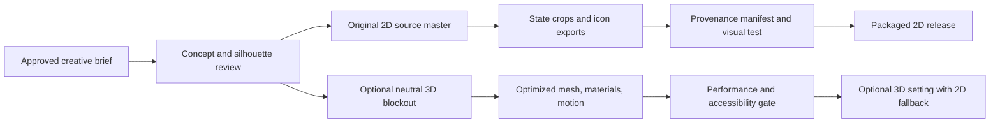

# Master Chief Hologram — Graphics and 3D PAPM Plan

Version 1.5 · 2026-09-13 · Owner: Master Chief program · Status: G0–G3 foundations and a G4 interactive WebGL prototype implemented; final mesh/rig work remains pending

## Mission and decision authority

Create a recognizable, accessible holographic desktop companion that feels premium at launcher and in-app sizes while remaining original, performant on supported Apple-Silicon Macs, and reversible. The immediate release path is a verified 2D visual system. A real-time 3D mode is a separately gated enhancement, never a dependency for voice, local AI, or release reliability.

The owner approves character direction and any public-facing identity change. PAPM maintains scope, schedule, risks, and gates. Leonardo owns art direction; Jarvis owns runtime integration; Chief UX and Sergeant Visual Standards own usability and consistency; Quartermaster and Staff Judge Advocate review provenance and licenses. This plan does not authorize purchasing assets, using a third-party character, or publishing a new identity.

## Baseline and success measures

The current application uses an original generated command-avatar fallback (`assets/master-chief-hologram-v1.png`), day/night state images, launcher artwork, and a local deterministic manifest. `npm run test:visual` verifies fourteen approved assets plus the UI state contract. [ART_PROVENANCE.md](ART_PROVENANCE.md) records the original-character prompt and explicitly excludes Halo character armor, helmet, green sci-fi armor, logos, weapons, and franchise imagery.

Success means that, at 16–128 px launcher sizes and the 280 px hologram stage, a user can identify the app, see whether it is ready/listening/thinking/needs attention, operate every control without relying on animation or color, and use the app without GPU instability. Every distributed asset has a recorded source, license or generation record, intended use, revision, and approval state.

## Use cases and visual blueprint

| Scenario | Required visual behavior | Acceptance evidence |
|---|---|---|
| Finder/Desktop launcher | A unique, crisp original holographic officer icon is readable at macOS icon sizes and contains no franchise identifier. | macOS Finder inspection at 16, 32, 64, and 128 px; approved `.icns` source set. |
| Idle command center | Character remains secondary to the prompt and response controls; dark/light background preserves separation. | Manual visual check at standard and enlarged text settings. |
| Listening or processing | State is communicated through label, icon, and motion-safe image treatment; it is not color-only. | Keyboard/screen-reader and reduced-motion checks. |
| Missing/corrupt media | The app shows the approved still or SVG fallback and remains usable. | Deliberate asset-failure smoke test. |
| Optional enhanced mode | User can enable a 3D hologram without degrading core chat or input; fallback occurs automatically on unsupported hardware. | Capability, frame-time, memory, and fallback record. |

Visual hierarchy: **command input and status first; character second; ambient effects last**. The character direction is an original naval command AI: dark-navy uniform or abstract command silhouette, cyan projection light, restrained scanlines, clear facial/pose readability, no weapons or protected franchise-signifying armor. Preserve a one-sentence non-franchise creative brief in every commissioned or generated asset request.

## IP, trademark, and provenance controls

The product name can create a Halo association even when the artwork is original. Until a qualified legal review says otherwise, do not use Halo logos, UNSC marks, names of franchise characters, recognizable green armor/visor language, copied game audio, screenshots, third-party fan art, or claims of affiliation. The app’s visual copy should describe an **original holographic command companion** rather than imply official franchise endorsement. A name/marketing review is a release decision, not an art-only decision.

For every new asset, record: immutable source file hash; creator or generation tool; prompt/version when generated; source references; license or rights basis; permitted channels; editing restrictions; model/material/texture dependencies; reviewer; and replacement/fallback asset. Do not treat an internet image, GitHub repository, marketplace preview, or model download as licensed solely because it is accessible. Keep raw provider credentials and personally supplied reference images outside tracked provenance files.

## Asset and production pipeline

| Layer | Source of truth | Production rule | Deliverables |
|---|---|---|---|
| Creative system | `docs/` brief and approved reference board | Version palettes, typography, state semantics, silhouette, and exclusions before asset work. | Visual style brief; state matrix; icon brief. |
| 2D master | Editable original master outside runtime exports | Work at high resolution with alpha; preserve layered/source formats where available. | Character master, neutral and state poses. |
| Runtime images | `assets/` plus `assets/visual-state-manifest.json` | Export deterministic PNG/WebP/JPEG only when alpha/quality needs are verified; no untracked runtime replacement. | Icon PNGs, state crops, fallback SVG. |
| 3D source | Versioned `.blend` or equivalent source under a dedicated tracked-art LFS/repository policy | Freeze mesh/material version before export; no runtime-only source. | Blockout, final mesh, materials, rig, animation clips. |
| Runtime 3D | glTF/GLB with declared decoder/runtime | Use compressed texture/mesh formats only after target-device test and license review. | Optimized GLB, poster image, 2D fallback. |

Recommended 2D state set: idle, ready, listening, thinking, success, attention/error, and offline. Each state must have text status and a non-color cue. Minimize variants: share a base pose, palette, lighting direction, and crop grid; create a new image only when it provides a distinct operating signal.

### 2D-to-3D decision options

| Option | Best use | Benefits | Constraints / gate |
|---|---|---|---|
| Refined 2D stills with CSS depth | Current release | Smallest package, simplest provenance, reliable fallback. | Use this as default until 3D passes its own gate. |
| Layered 2.5D/parallax | Premium perceived depth without full character rig | Reuses 2D art; modest CPU/GPU cost. | Must respect reduced motion and avoid text/control occlusion. |
| Low-poly 3D character in glTF | Optional interactive hologram | Real lighting, pose reuse, future animation. | Requires original mesh/texture rights, WebGL capability checks, memory/frame budget, and 2D fallback. |
| Pre-rendered 3D loops/video | Rich idle presentation | No interactive renderer complexity at runtime. | Video size, codec compatibility, poster/fallback and reduced-motion toggle required. |

Start with an original neutral 3D blockout only after the 2D style brief is approved. Do not use image-to-3D output as final production geometry without topology, texture-rights, artifact, and similarity review. Retopology, UVs, material baking, and a reproducible GLB export are required before runtime integration.

## Technical budgets and accessibility

Budgets are targets to be measured on the supported device matrix, not demonstrated current facts.

| Area | 2D default target | Optional 3D target | Measurement / rejection trigger |
|---|---:|---:|---|
| Active visual memory | ≤ 64 MB | ≤ 150 MB incremental | Reject/degrade if UI responsiveness or chat input degrades. |
| Package contribution | ≤ 25 MB | ≤ 100 MB incremental | Re-evaluate distribution and update cost above target. |
| Frame pacing | No sustained UI jank while idle | 30 fps minimum, 60 fps preferred | Drop to 2D on repeated long frames or context loss. |
| Draw footprint | One stage image plus controlled effects | One GLB, capped lights/materials/textures | Reject unbounded dynamic downloads or shader compilation stalls. |
| Motion | Reduced-motion setting removes float/scan animation | Same setting stops nonessential animation | Manual and automated contract check. |

Accessibility requirements: semantic status text; high-contrast-safe backdrop; keyboard focus never hidden by the hologram; zoom/text enlargement does not cover compose/send controls; reduced motion persists; state meaning does not rely only on cyan/red hue; image alt descriptions summarize status rather than decorative detail. The visual test manifest remains mandatory and should grow with every approved state or icon.

## WBS, dependencies, and readiness gates

| ID | Work package | Owner route | Depends on | Exit gate |
|---|---|---|---|---|
| G0 | Freeze original-IP creative brief, state taxonomy, and provenance schema. | PAPM + Leonardo + Visual Standards + SJA | Existing provenance | Owner approves direction; no franchise-signifying reference survives review. |
| G1 | Create original launcher-icon source set and target-size review sheet. | Leonardo + Chief Image Production | G0 | Icon reads at target Finder sizes; source/export mapping recorded. |
| G2 | Normalize current 2D state master/crops, fallbacks, and manifest approvals. | Leonardo + Jarvis + Quality | G0 | All runtime images hash-verified, legible, and recoverable. |
| G3 | Validate visual hierarchy, motion, contrast, focus, and text scaling. | Chief UX + Test Pilot | G2 | Keyboard, reduced-motion, high-contrast and fallback checklist passes. |
| G4 | Conduct 3D feasibility spike: original blockout, GLB export, renderer capability/fallback measurement. | Leonardo + Jarvis + Fleet Engineer | G0–G3 | Measured capability report meets budget or 3D is deferred. |
| G5 | Build/rig/animate optimized 3D companion and optional setting. | Leonardo + Jarvis | G4 owner go decision | Provenance, performance, recovery, and visual regression gates pass. |
| G6 | Package/release visual evidence and support documentation. | Operations + Training + Quality | G1–G3; G5 only if enabled | Package inspection, release note, and recovery guide complete. |

Critical path: G0 → G1/G2 → G3 → G6. G4/G5 are parallel option work and cannot delay the 2D launch path.

## Risks, assumptions, and decisions

| ID | Type | Effect | Control / decision | Owner |
|---|---|---|---|---|
| R-G1 | Trademark/confusion | Public-facing art/name may be mistaken for Halo. | Maintain exclusions; request qualified brand/legal review before public marketing or identity changes. | Owner + SJA |
| R-G2 | Asset rights | Incomplete generation or license records block safe release. | Require provenance before intake and retain a replacement/fallback route. | Quartermaster + Archivist |
| R-G3 | Performance | WebGL/3D may raise battery use, memory, or crash rate. | Default to 2D; capability test and automatic fallback. | Jarvis + Fleet Engineer |
| R-G4 | Accessibility | Motion/contrast can impair prompt interaction. | Text plus non-color state semantics, reduced motion, and manual assistive-tech checks. | Chief UX + Quality |
| A-G1 | Platform | Apple-Silicon macOS remains current supported target. | Rebaseline budgets before adding Intel/Windows support. | PAPM |
| D-G1 | Scope | 3D proceeds only after G4 evidence and owner direction. | No 3D runtime integration in the initial increment. | Owner |

## Initial incremental tasking

> Execute G0 only. Do not alter application code, packaged artwork, icon files, or untracked owner assets. Create a concise versioned visual style brief and an asset-intake/provenance schema under `docs/`. Reconcile the existing original-avatar record with an explicit original-IP/trademark exclusion list, define the seven required state semantics and non-color accessibility cues, specify target icon-size review criteria, and create an approval checklist that can drive the existing deterministic visual gate. Link the new artifacts from this plan, validate Markdown links, preserve secrets, run no asset-changing generation, and commit only the new documentation.

G0 deliverables: [VISUAL_STYLE_BRIEF.md](VISUAL_STYLE_BRIEF.md), [ASSET_INTAKE_SCHEMA.md](ASSET_INTAKE_SCHEMA.md), and the updated [ART_PROVENANCE.md](ART_PROVENANCE.md). No runtime artwork or user-owned untracked asset was changed.

G1 preparation: [ICON_REVIEW_SHEET.md](ICON_REVIEW_SHEET.md) and `npm test` verify the tracked icon export set. The human Finder-size review and any change to artwork remain pending owner approval.

The rejected 3D-rendered image prototype was removed because it did not meet the required interactive-3D quality bar. The current G4 prototype uses local Three.js geometry for a seated original command companion and chair; pointer movement, command state, and a click-driven wave change the scene in real time. The 3D switch persists and falls back to the approved 2D state artwork if WebGL is unavailable. It is a feasibility implementation, not a final GLB mesh: a reviewed source `.blend`, optimized GLB export, rig, authored clips, and measured performance record remain required for G5.

## Acceptance and sustainment

The 2D graphics increment is complete when its approved art has a source and provenance record, every runtime asset passes its manifest gate, target-size reviews show the launcher remains recognizable, and degraded/reduced-motion modes remain functional. The 3D increment is complete only when the same conditions hold plus the packaged optional mode meets the declared device measurements and falls back without loss of core interaction.

On each art revision: review at target size, inspect alpha and matte edges, confirm state semantics, update provenance and manifest in the same change, run `npm run test:visual`, retain the prior approved asset set for rollback, and record any deliberate budget variance. The next decision is G0 approval; after that, G1 and G2 may run in parallel.
