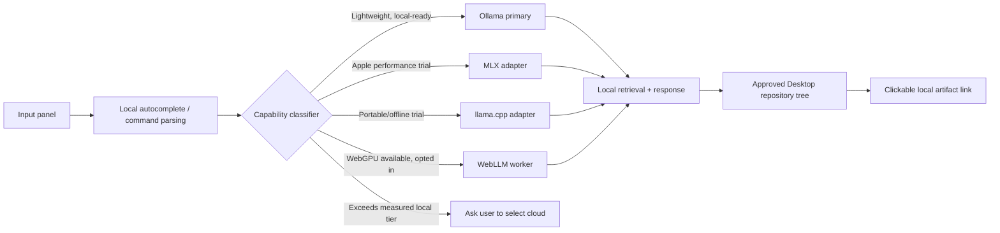

# Master Chief Hologram — Local-AI-First PAPM Plan

Version 1.1 · 2026-09-13 · Status: L0 implemented; measurement increments pending · Decision authority: owner

## Mission

Make the desktop companion answer lightweight prompts locally by default, keeping prompts, history, attachments, and inference on the Mac whenever a local route can meet the requested task. Cloud providers remain explicit, optional escalation paths for work that exceeds the chosen local model's measured capability. “No tokens” here means no paid or remote API inference for an eligible local turn; it does not claim that local computation is free of hardware, energy, storage, or model-license costs.

## Context checkpoint and current baseline

The application is an Apple-Silicon Electron app with a tested local Ollama route, a `qwen2.5:0.5b` starter model, local attachment indexing, safe credential storage, and optional cloud providers. It has no Hugging Face credential configured. The existing UI lists provider readiness and dynamically discovers Ollama models. This plan does not install a runtime, download a model, configure credentials, or alter application code.

The owner asked for local AI to become the recommended first path for lightweight prompts, local repository-tree storage and links for generated artifacts, lightweight input autocomplete, and a decision on Apache Spark for local-network resources. The separate graphics/3D plan and the broader PAPM release plan own their respective scopes.

## Users, scenarios, and measurable outcomes

| User scenario | Required behavior | Acceptance evidence |
|---|---|---|
| Quick command, rewrite, summary, or local-document question | App recommends an installed local route and completes the turn without a remote provider. | Provider trace says `local`; network-disabled test still completes. |
| Complex reasoning or quality-sensitive output | App explains why the selected local capability tier is insufficient and asks the user to choose a cloud route. | No automatic cloud escalation; clear capability/fallback message. |
| Local work artifact is created | Artifact is placed beneath an owner-selected Desktop repository tree and the response exposes a clickable local link. | Link resolves; Git/project path is shown; no arbitrary path write. |
| Prompt composition | Lightweight local suggestions/autocomplete remain responsive and never send draft text off-device. | Keyboard, latency, privacy, and dismissibility tests. |
| Home-LAN resource consideration | Distributed compute is introduced only when it has a measured batch-work benefit. | Spark decision gate and benchmark record. |

Targets are deliberately measured before being committed: p95 time-to-first-token and completion latency by model/device, memory pressure, success on a local evaluation set, local-route rate for eligible prompts, and zero unexpected outbound inference requests. No throughput, quality, or cost figure is assumed in advance.

## Scope and non-goals

Included: provider routing policy; local runtime adapters; capability tiers; model/cache lifecycle; local retrieval and prompt controls; evaluation; privacy boundaries; Desktop artifact-tree contract; autocomplete design; and a local-network compute decision.

Excluded: mandatory cloud credentials, hidden routing to any cloud API, downloading or redistributing model weights, training/fine-tuning, unattended LAN discovery, running Apache Spark by default, public multi-user service hosting, or writing outside a user-approved workspace root.

## Technical evidence and option assessment

| Option | Fit and evidence | Recommendation |
|---|---|---|
| **Ollama** | Already integrated and tested locally. Its documented local API defaults to `localhost:11434`; the local API needs no authentication. [Ollama API](https://docs.ollama.com/api/introduction) | **Primary release runtime.** Retain the existing adapter and discover locally installed models. |
| **MLX / MLX LM** | Apple’s MLX ecosystem targets Apple silicon; MLX LM supports local generation, quantization, Hugging Face model access, and fine-tuning. [MLX LM](https://github.com/ml-explore/mlx-lm) | **Evaluate as an Apple-Silicon performance tier**, behind an OpenAI-compatible local adapter. Do not make Python a launch dependency until packaging, memory, and update support are proven. |
| **llama.cpp** | A portable native runtime with a lightweight OpenAI-compatible `llama-server`, GGUF model format support, embedding and reranking server modes. [llama.cpp](https://github.com/ggml-org/llama.cpp) | **Secondary runtime and offline portability path.** Prefer it for a self-contained GGUF/ASR-adjacent distribution study and constrained structured output. |
| **WebLLM** | Runs models in-browser using WebGPU, OpenAI-compatible APIs, streaming, JSON mode, and workers. [WebLLM](https://github.com/mlc-ai/web-llm) | **Experimental browser tier only.** Use a worker and capability probe; avoid making it the default because Electron/WebGPU support, artifact storage, model download size, and memory need empirical validation. |
| **Transformers.js** | Runs ONNX-backed models locally in browser/Node and can use WebGPU, but browser WebGPU availability varies. [Transformers.js](https://github.com/huggingface/transformers.js/) | **Use first for small local embeddings/classification/autocomplete experiments**, not the primary chat runtime. |
| **Cloud providers** | Capable optional routes, but require explicit configured credentials and can send prompts externally. | **Manual, user-visible escalation only.** Never silently replace a local response. |

### Apache Spark decision

Apache Spark is a distributed data-processing engine, not a local LLM inference server. A single-user desktop chat, autocomplete, retrieval, and one-Mac artifact tree do not justify its operational footprint. The plan therefore rejects Spark for the default app path.

Spark may be reconsidered only for an owner-operated local network batch workload such as indexing many large approved document collections, evaluating many model/prompt combinations, or offline analytics across versioned logs. Before any use, define fixed host allowlists, mutual authentication, encrypted transport, a data-retention rule, hardware ownership, benchmarked benefit over a single-machine queue, and a shutdown/cleanup procedure. No user prompt or attachment may be replicated to LAN workers by default. A bounded local worker queue, SQLite/JSONL job ledger, and one compute host are the baseline until Spark demonstrates a material measured benefit.

## Blueprint

Source-of-truth boundaries: the renderer owns drafts and visual state; the main process owns provider selection and all outbound network authority; the local provider registry owns runtime/model metadata; a user-approved workspace registry owns artifact roots; the index owns attachment provenance and deletion; settings store consent and routing preference, never raw cloud secrets in the renderer.

## Routing policy

1. Classify without transmitting the prompt: command autocomplete, intent heuristics, selected model, installed-runtime health, context length, attachment type, and an explicit user preference.
2. Route to a local tier when it is installed, healthy, within a measured context/resource envelope, and the task belongs to its supported class.
3. Show the selected runtime/model and a short reason before generation. The user can override it.
4. If a local route fails, offer retry, a smaller local tier, or a cloud provider selector. Cloud is never automatic.
5. Record a redacted local decision event: runtime, model manifest/version, prompt class, outcome, latency, and failure code. Do not log the raw prompt, attachment text, or credentials.

Initial lightweight classes: short rewrite, extraction into fixed JSON, local-history search, prompt completion, command palette intent, concise summaries of bounded local text, title/file-name suggestions, and input autocomplete. Explicitly defer long-context synthesis, ambiguous high-stakes advice, broad research, large codebase refactors, multimodal reasoning, and tool planning until local evaluation supports them.

## Model capability tiers

| Tier | Intended work | Candidate size class | Selection gates |
|---|---|---|---|
| 0 — deterministic | Slash commands, templates, static snippets, path completion, local search. | No generative model. | Always first when it can satisfy the request. |
| 1 — micro local | Autocomplete, labels, classification, short extraction/rewrite. | Small embedding/classifier or sub-1B instruct model. | Responsive on target hardware; bounded output and local test set pass. |
| 2 — light local | Short chat, local-document Q&A with citations, compact coding help. | Approximately 1B–4B quantized instruct model. | Measured quality and memory/latency fit; retrieval citations pass. |
| 3 — capable local | Longer structured assistance and private work requiring better reasoning. | Approximately 4B–8B quantized model, hardware permitting. | Separate evaluation proves benefit over Tier 2. |
| 4 — explicit cloud | Tasks outside the measured local envelope. | Configured provider. | User selects route and confirms external-processing boundary. |

Model names, licenses, weights, disk use, quality, and hardware fit must be captured in a model manifest before a model becomes a recommended default. Use model-family names only after a license review; do not assume that a public model is redistributable with the app.

## Work breakdown, dependencies, and gates

| Work package | Owner route | Dependency | Deliverable | Exit gate |
|---|---|---|---|---|
| L0 — Baseline and contracts | PAPM + Jarvis + Signals | Existing provider IPC | Versioned local provider, model manifest, routing and artifact-root contracts. | Contract tests show renderer cannot select an unapproved endpoint or write arbitrary paths. |
| L1 — Local-first UX | Chief UX + Prompt Engineering | L0 | Visible local recommendation, override, offline state, and fallback explanation. | User can identify route/model and decline cloud in manual test. |
| L2 — Ollama hardening | Jarvis + Quality | L0 | Local health, capability metadata, resource/error states, cancellation, basic telemetry ledger. | Network-disabled local smoke passes; no secret/raw prompt appears in logs. |
| L3 — Artifact repository tree | Jarvis + Archivist | L0 | Workspace-root chooser, per-project folders, index, local-link response contract, retention/delete lifecycle. | Files and links stay inside approved root; path traversal/duplicate-name tests pass. |
| L4 — Lightweight autocomplete | Chief UX + Jarvis + Prompt Engineering | L1 | Deterministic completions first, optional Tier-1 local model worker, keyboard controls. | Suggestion p95 and focus tests meet a measured target; drafts never leave device. |
| L5 — Runtime comparison | Jarvis + Fleet Engineer + Quartermaster | L2 | Reproducible Ollama vs MLX vs llama.cpp vs WebLLM benchmark matrix. | Recommendation based on recorded quality/latency/memory/license/packaging evidence. |
| L6 — Retrieval/evaluation | Warrant Officer Data + Prompt Engineering + Quality | L0 | Citation contract, red-team set, local prompt classes, regression pack. | Local answers cite correct source; unsafe/unsupported tasks decline or ask. |
| L7 — WebGPU experiment | Jarvis + Test Pilot | L5 | Opt-in worker prototype and hardware capability report. | UI stays responsive; no model download without clear consent; fallback is clean. |
| L8 — LAN batch decision | Systems Architect + Security + Operations | L5/L6 evidence | One-host queue benchmark; Spark decision record. | Spark remains rejected unless defined batch case clears security and benefit gates. |

Critical path: L0 → L1/L2 → L3/L4 → L5/L6. WebGPU and LAN work are parallel experiments after the core local route is measured. Estimates are intentionally relative because hardware inventory, target macOS range, model choices, and benchmark results are not yet known.

## Caching, retrieval, privacy, and performance rules

- Keep exact deterministic-template results and local autocomplete dictionaries in-process or on-device. Evict with a bounded LRU and version by prompt/template/model manifest; do not cache secrets or sensitive raw prompts.
- Cache local model weights only in runtime-controlled directories with a recorded checksum, license, size, source, version, and deletion action. A model download requires a visible size/source confirmation.
- Reuse prompt-prefix/KV caching only within the selected local runtime and session, clear it on model switch or explicit privacy clear, and never mistake cached output for durable memory.
- Retrieval remains local. Store source ID, chunk bounds, index schema, timestamp, and delete/reindex lifecycle; return citations to the local source/artifact.
- Enforce context and output budgets per tier. Trim retrieved context by source relevance, preserve citations, and surface when context was reduced.
- Measure time-to-first-token, completion rate, tokens/sec, peak resident memory, energy/thermal state where platform APIs allow, failure modes, and UI responsiveness. Do not select a “fastest” runtime without a reproducible target-device matrix.

## Evaluation and acceptance evidence

Build a redacted, local evaluation pack with: deterministic command cases; 30–50 lightweight rewrite/extraction prompts; local attachment questions with expected citations; autocomplete keystroke cases; model-unavailable/low-memory/cancel cases; local-only network-disabled runs; and explicit cloud-consent/fallback cases. Maintain prompt version, model manifest, settings, device class, expected result, actual result, reviewer, and pass/fail reason.

Release the local-first path only when it meets all of these gates:

1. Eligible lightweight turns work with all remote provider settings disabled.
2. No code path silently uses a cloud route after local failure.
3. The user can select, inspect, unload, and remove an installed local model.
4. Artifact links resolve only beneath the approved Desktop repository root.
5. Autocomplete works by keyboard, is dismissible, respects reduced motion, and does not block ordinary typing.
6. A benchmark record supports the selected default runtime on each supported device class.

## Risks, decisions, and mitigations

| ID | Risk / decision | Mitigation and evidence needed | Owner |
|---|---|---|---|
| LAI-01 | Small models may hallucinate or fail complex work. | Restrict task classes; evaluate; label capability and offer explicit escalation. | Prompt Engineering + Quality |
| LAI-02 | Local models compete with Electron/graphics for unified memory. | Resource admission control, model unload, measured device tiers, recovery state. | Fleet Engineer + Jarvis |
| LAI-03 | Model download, license, or redistribution may be unsuitable. | Manifest/license/source/checksum review before recommendation or bundling. | Quartermaster + Staff Judge Advocate |
| LAI-04 | WebGPU may vary by Electron/device. | Opt-in capability probe and worker isolation; retain Ollama fallback. | Test Pilot |
| LAI-05 | A network worker could leak sensitive prompts. | Default localhost-only; explicit LAN opt-in; encryption/authentication; no automatic discovery. | Security + Operations |
| LAI-06 | Spark adds operational burden without interactive benefit. | Keep rejected unless batch benchmark and controls clear L8 gate. | Systems Architect + PAPM |
| LAI-07 | Artifact paths could escape the workspace. | Canonicalize paths, allowlist roots, use opaque artifact IDs, test traversal. | Jarvis + Security |

## Resource and sustainment baseline

No purchase, cloud contract, model download, or service installation is authorized by this plan. The near-term materials are a supported Apple-Silicon device matrix, local disk/memory measurements, an approved Desktop workspace root, a local benchmark pack, runtime release notes, model-license records, and a recovery/runbook document. Sustainment requires runtime/model updates to be staged, verified against the evaluation pack, and reversible before becoming a default.

## Specialist orchestration record

| Specialist | Bounded output | Handoff / acceptance |
|---|---|---|
| PAPM | This local-AI baseline, WBS, risk and decision record. | Master Chief reconciles implementation tasking. |
| Jarvis | Adapter, IPC, local model lifecycle, artifact-root security design. | Contract and failure-mode tests. |
| Prompt Engineering | Local task taxonomy, prompt/output contracts, evaluation and rollback pack. | Tier acceptance thresholds. |
| Chief UX | Local recommendation, fallback disclosure, autocomplete and accessibility flow. | Keyboard and comprehension evidence. |
| Warrant Officer Data + Archivist | Provenance, citation, retention, repository-tree model. | Delete/reindex/link integrity evidence. |
| Fleet Engineer | Memory, latency, thermals, concurrency benchmark protocol. | Reproducible device matrix. |
| Sergeant Major Security + Safety Officer | Privacy, LAN, artifact-path and consent review. | Threat model and allow/deny tests. |
| Lieutenant Quality + Test Pilot | Regression pack and real Electron/macOS flow verdict. | Recorded gate result. |
| Quartermaster + Staff Judge Advocate | Runtime/model supply and license review. | Approved manifest basis. |
| Training Officer | Local-model setup, offline recovery, workspace/artifact-link guide. | New-user walkthrough. |

These routes are planned work, not claims that a specialist has completed implementation.

## First reconciled execution increment

> Implement L0 only. Preserve untracked owner assets and secrets. Add a versioned local provider/model manifest and a local-routing contract that defaults eligible lightweight tasks to a healthy installed local runtime, without changing external credentials, downloading models, or enabling a cloud fallback. Define an approved Desktop workspace-root/artifact-link contract without writing artifacts yet. Add deterministic tests for route selection, cloud opt-in, model-health failure, and workspace path rejection. Update implementation status and this plan’s decision record, run relevant checks, and commit the focused increment.

L0 implementation: [local-ai-manifest.json](../local-ai-manifest.json) records Ollama as the localhost-only primary runtime and `qwen2.5:0.5b` as an owner-installed micro-local development model. [local-ai-manifest.js](../local-ai-manifest.js) validates the manifest and selects a local default only when that model is installed. The UI exposes the local-first state and stops rather than silently escalating to cloud. License review remains required before redistribution or bundling.

## Standby backlog

1. Measure and tune the current Ollama starter model against the local evaluation pack.
2. Add a local embedding-model adapter for retrieval quality comparison.
3. Add token/sentence-aware streaming autocomplete from a Tier-1 local model after deterministic autocomplete ships.
4. Evaluate MLX and llama.cpp on the target Apple-Silicon hardware matrix.
5. Build WebLLM worker proof of concept behind explicit model-download consent.
6. Add local model disk manager, checksum verification, unload, delete, and rollback UX.
7. Add artifact repository browser with source/provenance links and versioned exports.
8. Create a one-host batch index/evaluation queue before any Apache Spark experiment.
9. Add optional local speech/TTS routing only after physical microphone closure and model-license review.
10. Add recurring, opt-in benchmark refreshes that never upload prompts or documents.
