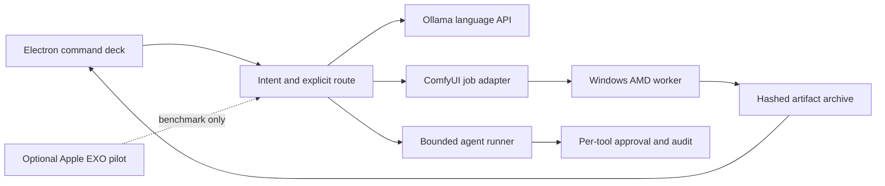

# Master Chief Local AI Expansion Plan

Version 1.0 — 2026-09-19  
Mission run: `MC-AI-EXPAND-20260919`  
Context packet: `MC-AI-EXPAND-CTX-v1`

## Mission and decisions

Build one local-first interface for chat, coding, image, video, reference continuity, and bounded agent work without destabilizing the working Windows ComfyUI path. The controller is an M1 iMac with 16 GB unified memory. The creative worker is Windows with an AMD Radeon RX 9060 XT and approximately 16 GB VRAM. Other Apple nodes require inventory before cluster commitments.

Success means the app visibly reports work in progress, exposes commands and skill routes, preserves and opens artifacts, checks spelling, accepts keyboard completion, and refuses to promote a runtime/model until its hardware, license, checksum, workflow, recovery, and real-output checks pass.

Decisions:

1. Keep Electron as the operator interface and its main process as the network authority.
2. Keep ComfyUI as the image/video engine. Pinocchio/Pinokio may be evaluated as an isolated installer laboratory, not placed in the production request path, because its scripts can execute arbitrary terminal operations.
3. Keep Ollama as the primary local language-model API. Add FastAPI only when more than one runtime needs a normalized job/event contract.
4. Do not add LangGraph or AutoGen until a durable job ledger, approval state, resumability tests, and tool schemas exist. The current bounded agent runner remains the release baseline.
5. Pilot EXO only across compatible Apple-silicon nodes after a wired-network benchmark. Do not make EXO a dependency of the AMD Windows ComfyUI worker.
6. Add model families through manifests and gates, never by silently downloading every requested model.

## Evidence and fit

- FACT: EXO focuses on distributed local inference, automatic discovery, topology-aware partitioning, and MLX support. Its best fit here is an Apple-silicon experiment, not the production media path: https://github.com/exo-explore/exo
- FACT: ComfyUI exposes queue/history and workflow APIs and remains the existing working creative interface: https://docs.comfy.org/development/core-concepts/api
- FACT: Pinokio describes itself as a launcher whose scripts can execute terminal commands; verified scripts are isolated and reviewed, but production use still requires source review and rollback: https://github.com/pinokiocomputer/pinokio
- FACT: Z-Image Turbo is Apache-2.0, six billion parameters, and its model card says it fits within 16 GB consumer VRAM. It is the strongest new image pilot candidate after AMD workflow verification: https://huggingface.co/Tongyi-MAI/Z-Image-Turbo
- FACT: Diffusers documents a quantized CogVideoX 5B path around 16 GB VRAM, with lower-memory offload options. The documented path is CUDA-centric, so AMD Windows compatibility remains unverified: https://huggingface.co/docs/diffusers/api/pipelines/cogvideox
- FACT: Mochi's reference repository calls for about 60 GB VRAM on one GPU; it is not a default fit for this worker: https://github.com/genmoai/mochi
- FACT: LangGraph emphasizes durable execution and human-in-the-loop orchestration; evaluate only after the app has a durable job contract: https://github.com/langchain-ai/langgraph
- FACT: AutoGen provides agent abstractions and extensions but would duplicate the existing bounded runner before those contracts mature: https://microsoft.github.io/autogen/stable/

## Model adoption matrix

| Candidate | Disposition | Reason / gate |
|---|---|---|
| SDXL + Juggernaut XL | ADOPT current baseline | Already supported; test prompt adherence, revision, archive, and GPU release. |
| Z-Image Turbo | EXPERIMENT next | Published 16 GB fit; require AMD-Comfy workflow and 10-prompt acceptance set. |
| FLUX.1 Schnell | EXPERIMENT later | Useful fast-image option; require license record, quantized AMD workflow, disk/VRAM measurement. |
| Qwen-Image | DEFER | Evaluate only after a supported ComfyUI workflow and measured 16 GB fit. |
| Stable Diffusion 3.5 Large | DEFER | Duplicates image capability until it demonstrates a measured quality advantage. |
| CogVideoX | EXPERIMENT video pilot | Memory-reduced path exists, but AMD Windows support must be proven. |
| LTX family | EXPERIMENT video alternative | Prefer the smallest maintained ComfyUI workflow; exact requested “2.5” identifier must be verified before installation. |
| HunyuanVideo 1.5 | DEFER | Treat as a later AMD compatibility/capacity study. |
| Mochi 1 | REJECT on this GPU | Reference implementation is far beyond 16 GB VRAM. |
| MiniMax H3 | DEFER / hosted option | Large video model; no local-fit claim is accepted without measured evidence. |
| DeepSeek-Coder-V2 | DEFER to language benchmark | Use a quantized supported variant only if it beats the current coding model on the local evaluation set. |

## Architecture and flow

Normal media flow: prompt → validated workflow → queue → visible elapsed status → output hash → archive → preview/revise/download. Failure flow: unreachable worker or invalid workflow → visible error → preserve prompt/session → retry after health gate. Recovery flow: restart → recover artifact cards and active revision session.

## Install and release gates

| Gate | Entry | Exit evidence | Rollback |
|---|---|---|---|
| G0 Preflight | Windows online | Hardware, disk, Git, driver report | No mutation |
| G1 Core worker | G0 pass | SSH automatic, ComfyUI boot task, API healthy | Restore prior task/script |
| G2 Current image | G1 pass | SDXL/Juggernaut checkpoint, generation/revision/archive tests | Restore prior workflow/model choice |
| G3 Operator UX | Automated tests | Progress, `/`, `@`, Tab, spellcheck, Archive real-flow test | Restore archived app bundle |
| G4 Upscale | G2/G3 pass | Approved node/model checksum and before/after fixture | Remove node/model; retain original |
| G5 New image pilot | 100 GB reserve | Z-Image or FLUX AMD workflow; 10-prompt score ≥ baseline | Unload/remove pilot; baseline unchanged |
| G6 Video pilot | G1 and capacity pass | One short clip, cancel/retry, VRAM recovery, license evidence | Disable video route/remove pilot |
| G7 Agent service | Schemas and ledger exist | Resume, approval, idempotency, timeout, rollback tests | Bounded runner remains default |
| G8 EXO cluster | Apple inventory + wired baseline | Cluster beats single-node on approved benchmark without privacy regression | Stop EXO; independent nodes remain |

## Interface roadmap

1. Current increment: elapsed operation status, slash and skill autocomplete, Tab acceptance, spellcheck, Archive access, persistent creative sessions.
2. Reference Studio: character/project sheets, approved reference images, shot IDs, seed/model/workflow metadata, continuity locks, multi-shot queue, comparison and promote/reject controls.
3. Media controls: explicit positive/negative prompts, seed, strength, size, steps, model, upscale, cancel, retry, GPU-release, and provenance drawer.
4. Runtime control: node health, queue depth, disk/VRAM evidence, model manifests, install/pilot/promote/rollback actions.
5. Agent layer: FastAPI job/event contract, SQLite ledger, tool approvals, then a LangGraph comparison against the built-in runner.

## Specialist routing record

Primary route: Context Manager → PAPM → Jarvis → Systems Architect → Chief UX → Signals Officer → Prompt Engineering → DevSecOps Officer → Test Pilot → Chief Operations → Archivist → Quartermaster. Fleet Engineer and Training Officer were added by the token-index backup because hardware capacity and operator runbooks change release decisions. Captain AI Systems, Leonardo, and Colonel Videographer remain follow-on routes for model evaluation, reference-studio visual design, and multi-shot video continuity. Unrelated game, cyber/RMF, satire, and public-affairs skills were rejected for this increment.

## Quality gates

Foundation Plan Gate: **86/100 — PASS**. Strengths: bounded architecture, staged adoption, hardware-aware decisions, recovery, evidence, and rollback. Gaps: remaining Apple-node inventory, measured AMD video compatibility, exact model sizes/checksums, and user-approved storage budget.

Final Product Gate for this increment is not declared until packaging and real-flow checks complete. The whole roadmap remains `IN PROGRESS`; no deferred model is represented as installed.

## Upgrade standby

1. P0: finish and verify G3 operator UX.
2. P0: establish Windows readiness evidence and remote SSH health.
3. P1: add explicit positive/negative prompt fields and upscale job contract.
4. P1: build Reference Studio schema and multi-shot queue.
5. P1: benchmark Z-Image Turbo versus Juggernaut XL.
6. P2: prove one short AMD video workflow.
7. P2: inventory and benchmark Apple nodes for EXO.
8. P3: compare LangGraph with the bounded runner after durable job infrastructure exists.

