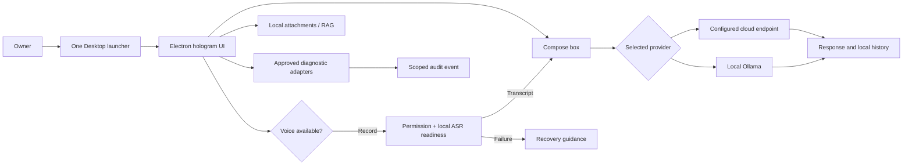

# Master Chief Hologram — PAPM Execution Plan v2

Version 2.0 · 2026-09-13 · Owner: grummpy · Status: proposed execution baseline

Current direction: execute this plan except Phase 3, **Provider completion**. Hugging Face setup remains deferred until the owner supplies a token. The graphics/3D, local-AI-first, and army-training work streams are maintained in their separate linked PAPM plans.

## Executive outcome

Ship a dependable, local-first macOS companion that opens from one Desktop launcher, accepts a spoken command into the input box, runs a selected local or cloud model, explains its readiness state, and only performs locally approved diagnostic actions. The next release target is a signed, recoverable release candidate; it is not a public multi-user agent platform.

## Current evidence and planning assumptions

The current source baseline is commit `c8f021f`. The packaged Apple-Silicon app opens, its deterministic package inspection passes, the visual regression check passes for 14 approved assets, and the automated suite passes 19 tests. Ollama is installed with a tested local `qwen2.5:0.5b` model. The Hugging Face endpoint remains intentionally unconfigured because no user token has been supplied. The app detects local voice prerequisites and has a deterministic self-test, but a real physical microphone capture-and-transcript acceptance run has not yet been recorded.

These facts are evidence, not a claim that a signed public release is ready. Estimates below are engineering ranges, with no vendor pricing, staffing commitment, or release date assumed.

## Mission, users, and success measures

| User / operating scenario | Required result | Acceptance evidence |
|---|---|---|
| Owner launches from Desktop | One current bundle opens or focuses; updater never overwrites a dirty or divergent checkout. | Cold launch, repeated launch, update, and rollback drills. |
| Owner speaks a command | Permission is clear; listening feedback appears; final transcript is inserted into the compose box; failures explain recovery. | Physical macOS microphone matrix on supported hardware. |
| Owner works privately | A local Ollama model remains usable without a cloud key; documents and local history remain on-device. | Offline model response and index provenance check. |
| Owner selects a cloud route | Missing credentials are visible without exposing secrets; configured route streams or reports a bounded error. | Provider health and redaction tests. |
| Owner invokes a diagnostic capability | Risk and scope are visible; approval precedes execution; audit log remains secret-free. | Allow/deny/execute adapter tests. |

Release success targets: one launcher, no raw credential in renderer/logs, successful final transcription in at least 19 of 20 controlled supported-device attempts, visible first streamed response within two seconds when the selected provider supports streaming and network conditions permit it, and a repeatable build/package/start/rollback record.

## Scope boundary and decision authority

Included: macOS Apple-Silicon Electron release, local Ollama, optional cloud endpoints, local attachment retrieval, microphone-to-text, bounded diagnostic adapters, accessibility, release automation, and local recovery.

Excluded from this release baseline: unattended external mutations, arbitrary shell access, background recording, public multi-user hosting, unreviewed external MCP servers, and a claim of notarization without a Developer ID identity. The owner provides credentials and release identity; PAPM maintains the baseline; Master Chief reconciles specialist outputs; implementation only accepts changes with the listed evidence.

## Product blueprint

Interfaces and source-of-truth boundaries: the renderer owns presentation only; preload exposes an allowlisted IPC contract; the main process owns provider routing, local index, tool policy, and secret handling; safe storage and ignored local environment files own credentials; Git source plus the release manifest own release provenance. Existing diagrams, visual brief, learning guide, and art provenance remain the foundation: [SYSTEM_FLOW.md](SYSTEM_FLOW.md), [visual-brief.png](visual-brief.png), [TECHNICAL_LEARNING_GUIDE.md](TECHNICAL_LEARNING_GUIDE.md), and [ART_PROVENANCE.md](ART_PROVENANCE.md).

## Work breakdown and critical path

| Phase | Deliverable and dependency | Estimate | Exit gate |
|---|---|---:|---|
| 0 — Baseline control | Update status, release manifest, and real-device test record; preserve untracked owner assets. | S | Repository diff is reviewable; no secrets or unrelated assets staged. |
| 1 — Voice closure | Physical microphone matrix: permission allow/deny, device absent, silence, normal speech, stop/retry, and offline whisper path. Package a supported local ASR model only after size/license review. | M | 19/20 final transcripts insert into compose box; all failure paths offer recovery. |
| 2 — Release closure | Apple Developer ID signing, notarization, Gatekeeper clean-device test, update rollback drill, and a release provenance record. | M, owner credential dependent | Signed/notarized candidate launches on a clean supported Mac and rolls back safely. |
| 3 — Provider completion | Provider settings UX, model capability badges, Hugging Face configuration only when a user token exists, and connection/stream/cancel matrix. | M | Every configured route has a successful request or actionable health state; no secret reaches UI/logs. |
| 4 — Knowledge quality | Source citations in answers, document delete/reindex lifecycle, retrieval evaluation set, and hybrid retrieval only if it improves measured relevance. | M | Citation points to source/chunk; delete removes retrieval; evaluation baseline is recorded. |
| 5 — Controlled expansion | MCP client design review, server allowlist, per-server capability consent, and first read-only adapter. | M | Unapproved server/tool cannot execute; approval and audit evidence are reproducible. |
| 6 — Product polish | Onboarding readiness check, accessibility audit, reduced motion/high contrast/text size, response recovery, and support export. | M | Core keyboard and screen-reader flow passes manual acceptance. |

Critical path: real microphone evidence → packaged ASR choice → signed/notarized candidate → clean-device and rollback acceptance. Provider and retrieval improvements may run after Phase 1 because they do not remove the release blockers.

## Specialist orchestration record

| Owner / route | Bounded task | Input → handoff | Acceptance evidence |
|---|---|---|---|
| PAPM | Maintain requirements, WBS, risks, decisions, forecasts, and readiness. | This plan → reconciled increment tasking. | Traceable status and gates. |
| Jarvis + Systems Architect | Voice/provider/release architecture and native dependency trade study. | IPC, package and runtime facts → implementation contract. | Threat and failure analysis. |
| Chief UX + Leonardo + Sergeant Visual Standards | Listening states, control hierarchy, mascot/icon continuity, accessibility visual review. | Current UI and approved art → annotated interaction spec. | Keyboard, contrast, asset regression evidence. |
| Prompt Engineering | Provider prompts, local retrieval citations, tool authority and evaluation cases. | Provider/RAG contracts → versioned evaluation pack. | Grounding, injection, and rollback cases pass. |
| Lieutenant Quality + Test Pilot | Device matrix, package smoke, visual/voice/provider regression gates. | Acceptance criteria → release verdict. | Recorded real-flow evidence. |
| Chief Operations + DevSecOps + Sergeant Major Security | Signing/notarization, update/rollback, dependency hygiene, logs and privacy controls. | Build scripts and release records → release runbook. | Clean-device and rollback drills. |
| Warrant Officer Data + Signals Officer | Retrieval schema, provenance, deletion, IPC/tool contracts. | Index and adapters → data/interface specifications. | Citation, deletion, and boundary tests. |
| Training Officer + Public Affairs Officer | Onboarding and operator recovery guide. | Final behavior → plain-language runbook and release notes. | A new user can set up local Ollama and recover common failures. |

These are planned routes, not claims that a specialist has already completed work. Phase owners receive only the baseline, task contract, relevant evidence paths, and acceptance gate.

## Risk, issue, and decision register

| ID | Type | Description | Control / decision needed | Owner |
|---|---|---|---|---|
| R-01 | Release risk | No Developer ID certificate is available in the project evidence. | Obtain authorized signing identity before Phase 2; retain ad-hoc package only for local testing. | Owner + Operations |
| I-01 | Open issue | Browser capture/readiness exists, but physical transcript insertion has not met the new release matrix. | Execute Phase 1 on target hardware; capture redacted results. | Quality + Jarvis |
| D-01 | Decision | Hugging Face endpoint has no token/configuration. | Keep optional until the owner supplies a token; do not fabricate or store one. | Owner |
| R-02 | Security risk | MCP/tool expansion could enlarge filesystem/network authority. | Begin read-only, schema-validated, per-server approval only. | Security + Signals |
| R-03 | Product risk | Bundling a whisper model increases application size and licensing/supply burden. | Select after measured latency, size, model-license, and offline value review. | Jarvis + Quartermaster |
| R-04 | UX risk | Hologram visuals can obscure controls or motion-sensitive users. | Enforce reduced motion, contrast, focus, and deterministic asset gates. | UX + Visual Standards |

## Resource, schedule, and sustainment basis

One experienced Electron engineer plus the specialist reviews can complete each small gate in days and each medium phase in roughly one to two engineering weeks after its dependencies are available. Signing/notarization timing depends on the owner’s Apple Developer account and external service response. Maintain one prior known-good bundle outside Desktop, a redacted diagnostics export, a small supported-device test matrix, versioned release provenance, and a quarterly dependency/permissions review.

## Increment tasking prompt

> Execute Phase 1, “Voice closure,” only. Preserve current untracked owner assets and secrets. On a supported macOS device, test microphone permission allow/deny, unavailable input, silence, ordinary speech, cancellation, retry, and the offline voice readiness path. Record a redacted evidence table. Fix only defects that prevent final speech transcription from appearing in the compose box. Add meaningful automated regression coverage where deterministic seams exist, package and inspect the app, run relevant tests, update `IMPLEMENTATION_STATUS.md` and this plan’s decision log, then commit the focused increment. Do not package a speech model, change external credentials, sign/notarize, or add broad tool access without the separately required evidence or owner input.

## Ranked upgrade standby

1. Signed/notarized clean-device distribution and rollback channel.
2. Physical voice acceptance matrix and a supported offline ASR package.
3. Provider settings and Hugging Face configuration after token availability.
4. Citation-first retrieval evaluation and delete/reindex lifecycle.
5. Read-only MCP client with server allowlist and per-server consent.
6. Conversation search, archival, and local encrypted database migration.
7. Push-to-talk and locale selection after reliable base capture.
8. Opt-in redacted crash diagnostics with local export.
9. WebGPU local model capability assessment against Ollama latency and memory.
10. Task timeline and resumable job IDs after first bounded multi-step workflow.

## Baseline artifact catalog

| Artifact | Version / status | Purpose |
|---|---|---|
| This plan | v2.0 proposed | Current PAPM baseline and task order. |
| [PRODUCT_IMPROVEMENT_PLAN.md](PRODUCT_IMPROVEMENT_PLAN.md) | v1.0 historical | Original researched Top-100 backlog. |
| [IMPLEMENTATION_STATUS.md](IMPLEMENTATION_STATUS.md) | v1.3 current | Completed increments and evidence. |
| [SYSTEM_FLOW.md](SYSTEM_FLOW.md) | v1.0.3 needs v2 refresh in Phase 0 | Flow and UML baseline. |
| [TECHNICAL_LEARNING_GUIDE.md](TECHNICAL_LEARNING_GUIDE.md) | current | Learner-facing architecture and alternatives. |
| [VISUAL_REGRESSION.md](VISUAL_REGRESSION.md) | current | Asset/state acceptance contract. |
| [VOICE_VERIFICATION.md](VOICE_VERIFICATION.md) | current | Deterministic voice test and physical-test boundary. |
| [GRAPHICS_3D_PAPM_PLAN.md](GRAPHICS_3D_PAPM_PLAN.md) | current | Separate visual identity and 3D-production baseline. |
| [LOCAL_AI_PAPM_PLAN.md](LOCAL_AI_PAPM_PLAN.md) | current | Local-first, lightweight-model and resource plan. |
| [ARMY_SKILLS_TRAINING_PLAN.md](ARMY_SKILLS_TRAINING_PLAN.md) | current | Failure-gap, skills, and training baseline. |
