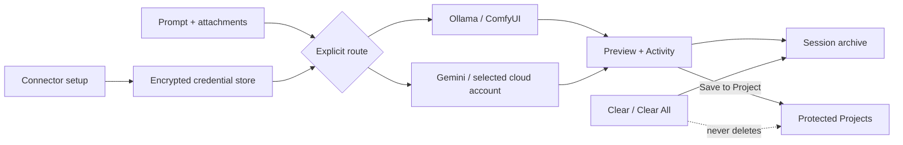

# Master Chief Hologram v1.12.0

## Mission and acceptance

Give one desktop command surface a local-first model route, durable Projects, account connector setup, output review, and visible recovery without allowing Clear or Clear All to erase approved project files.

Acceptance evidence:

- Professional, Personal, and Files replace the complete left rail.
- Personal view has no overlay badge over Commander Nova.
- Projects live in the application Projects directory and are excluded from private-history/media deletion.
- Generated media has Preview, Open, Reveal, Save As, and Save to Project paths.
- Gemini is an explicit cloud route with one-send confirmation.
- Gmail reports OAuth consent as incomplete until authorization exists.
- Suno and Cursor report only verified credential/CLI readiness.
- A transient chat failure receives one bounded same-provider retry and visible Activity evidence.

## System flow

## Decisions and boundaries

- Local Ollama stays the automatic default; the app never falls back to a paid route.
- Gemini uses Google's documented OpenAI-compatible endpoint.
- Gmail needs a complete OAuth consent/token flow; saving client credentials alone does not authorize mail access.
- Suno is registered through its official platform, but music-generation calls remain disabled until the API operation contract is verified.
- Cursor readiness uses the official Cursor Agent CLI or an explicitly supplied key. Workspace mutation still requires the normal tool approval boundary.
- This release does not embed a general remote desktop. The right rail exposes account health, previews, and live job/recovery activity; interactive browser/computer control remains a future bounded connector.

## Verification

- `npm test`: 94/94 passed.
- JavaScript syntax checks: passed.
- Asset validation: passed.
- Visual contract validation: passed.
- Production dependency audit: zero known vulnerabilities.
- macOS package inspection: passed; ad-hoc signed because no Developer ID certificate is installed.

## Standby backlog

1. Complete Gmail OAuth callback, encrypted refresh-token storage, least-privilege scopes, and mail read/search/draft tools.
2. Verify Suno API schemas and add reversible music jobs, progress, stems, metadata, and archive lineage.
3. Bridge Cursor Agent CLI with review-first workspace operations and structured streaming output.
4. Add a bounded browser/computer-use connector with explicit per-action approval and visual handoff.
5. Add project selection directly to every document and productivity-artifact card, not only generated media Preview.
6. Run representative viewport and keyboard-accessibility acceptance against the packaged app.
