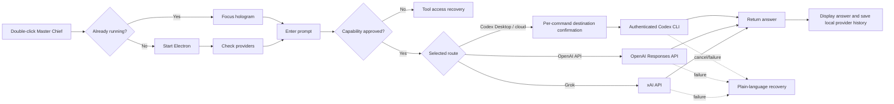
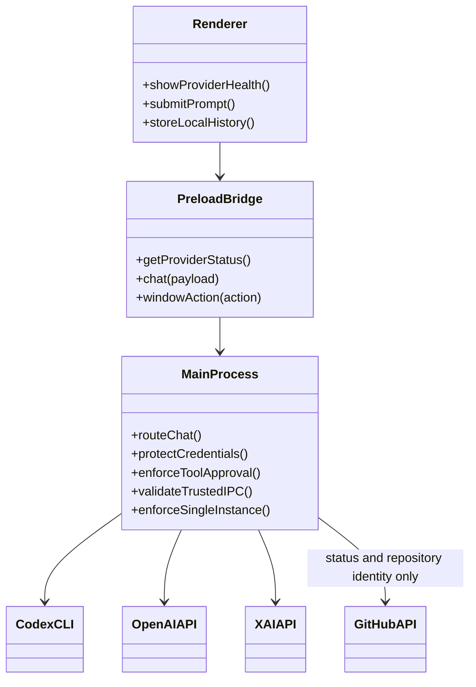

# Master Chief Hologram system flow and UML

Version: 1.1.0

Date: 2026-09-12

## User and system flow

```mermaid
flowchart LR
  A[Double-click Master Chief] --> B{Already running?}
  B -- Yes --> C[Focus hologram]
  B -- No --> D[Start Electron]
  D --> E[Check providers]
  C --> F[Enter prompt]
  E --> F
  F --> P{Capability approved?}
  P -- No --> R[Tool access recovery]
  P -- Yes --> G{Selected route}
  G -->|Codex Desktop / cloud| Q[Per-command destination confirmation]
  Q --> H[Authenticated Codex CLI]
  G -->|OpenAI API| I[OpenAI Responses API]
  G -->|Grok| J[xAI API]
  H --> K[Return answer]
  I --> K
  J --> K
  K --> L[Display answer and save local provider history]
  H -. cancel/failure .-> M[Plain-language recovery]
  I -. failure .-> M
  J -. failure .-> M
```

## Component boundary

```mermaid
classDiagram
  class Renderer {
    +showProviderHealth()
    +submitPrompt()
    +storeLocalHistory()
  }
  class PreloadBridge {
    +getProviderStatus()
    +chat(payload)
    +windowAction(action)
  }
  class MainProcess {
    +routeChat()
    +protectCredentials()
    +enforceToolApproval()
    +validateTrustedIPC()
    +enforceSingleInstance()
  }
  class CodexCLI
  class OpenAIAPI
  class XAIAPI
  class GitHubAPI
  Renderer --> PreloadBridge
  PreloadBridge --> MainProcess
  MainProcess --> CodexCLI
  MainProcess --> OpenAIAPI
  MainProcess --> XAIAPI
  MainProcess --> GitHubAPI : status and repository identity only
```
